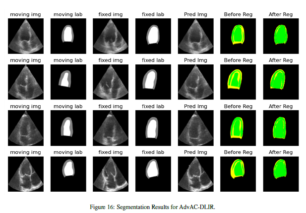

     
    

        <h2>Abstract</h2>
        

            The fetal heart can experience congenital heart malformation and functional abnormalities. Ultrasound imaging plays a vital role in assessing the heart structure and function of the developing fetus due to its non-incisive nature. However, the detection of such abnormalities via mass screening is only 50%, suggesting a need for further improvement. Many researchers have been working in order to detect abnormalities in the heart from ultrasound imaging through segmenting cardiac chambers, valves, and blood flow patterns but most of the works are based on adult hearts. This motivates us to explore fetal echocardiographic images for which we collected 4D volume fetal heart images to perform temporal registration to segment the myocardium and left ventricle chamber from these images. Having a deep learning-enabled standardized approach to evaluation can improve precision and accuracy. Thus, in this project, we propose to develop methods for automatic 3D segmentation based on temporal registration from 4D fetal echo images. The 4D fetal echo images were collected and properly annotated with the help of an existing cardiac motion estimation algorithm. Our proposed model is built upon UNET based image registration model as a baseline with the residual branch, which is guided by a variational autoencoder to enforce structural features of the heart via latent space training and adversarial learning. We also plan to make the proposed model perform multi-scale registration. We have developed and tested our proposed network for both 2D (Adult images from CAMUS Dataset) and 3D (Fetal Data) segmentation which showed significant performance in both cases. As evaluation metrics, Mean squared error, and Dice Metric were computed both before and after the registration process.
        

    

     

        
    

    

